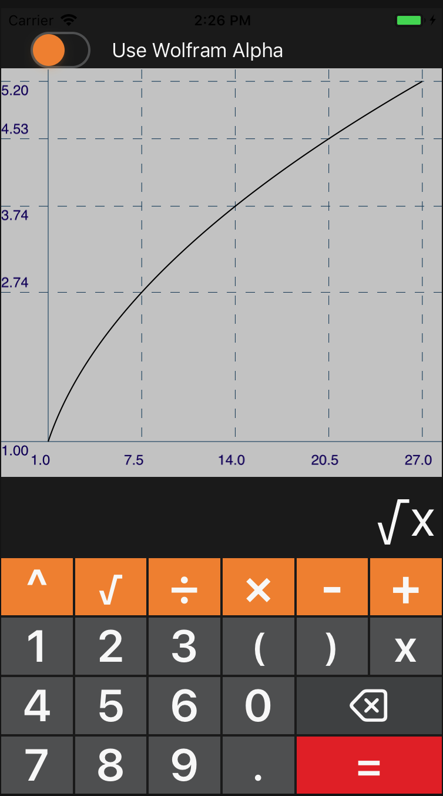
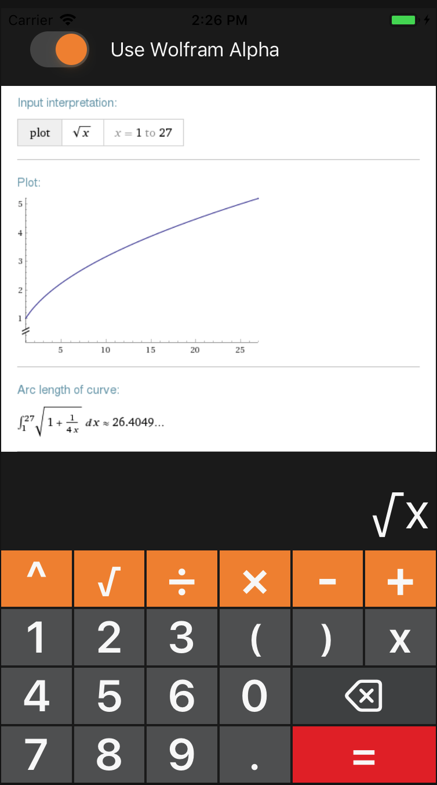

Задача
Разработать приложение-калькулятор, которое позволит ввести математическое выражение с одной переменной, задать диапазон значений этой переменной и построить график функции.
Модуль разбора выражений минимально должен поддерживать следующие операции:
* Сложение
* Вычитание
* Умножение
* Деление
* Унарный минус
* Скобки

В дополнение к собственному модулю разбора выражений, реализовать эту
же функциональность с использованием API Wolfram Alpha, а в приложении
добавить выбор между собственной реализацией и Wolfram Alpha.

Бонусное задание (не обязательно к выполнению)
Добавить также поддержку операции возведения в степень — x^y, а также извлечения квадратного корня — sqrt(x).

Технические требования
Запрещено использовать готовые библиотеки для построения графиков (например, d3.js для веб, Charts для iOS и т.д.).

      
